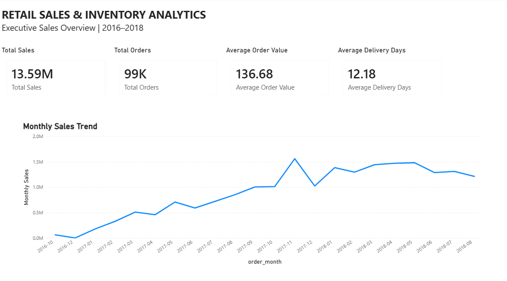
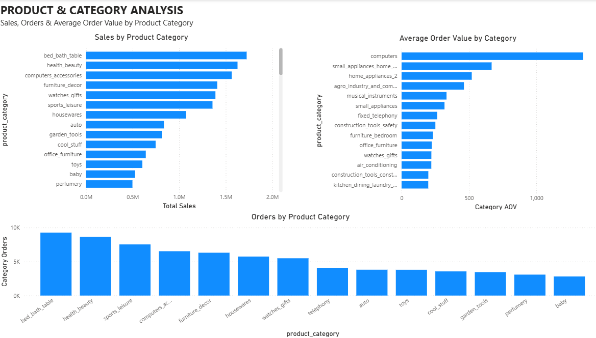
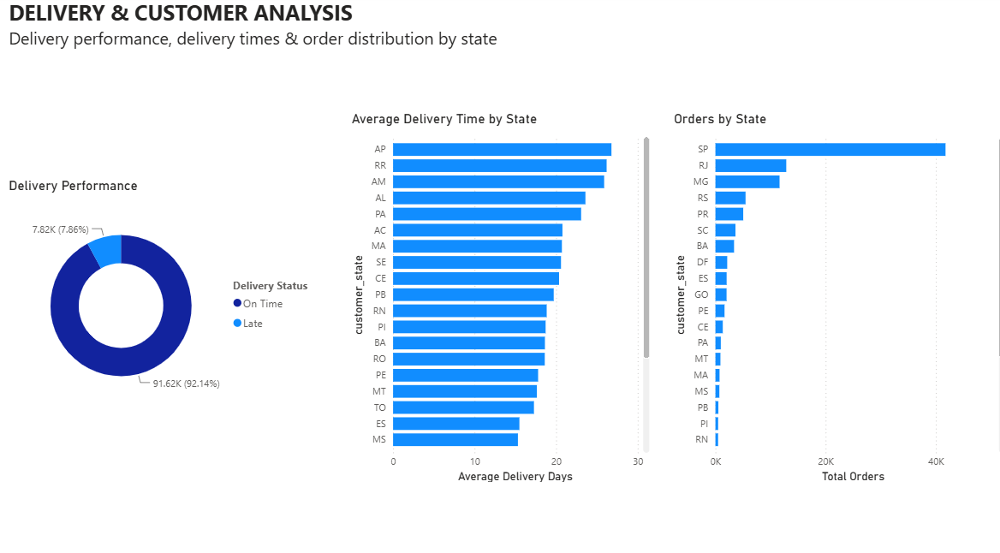
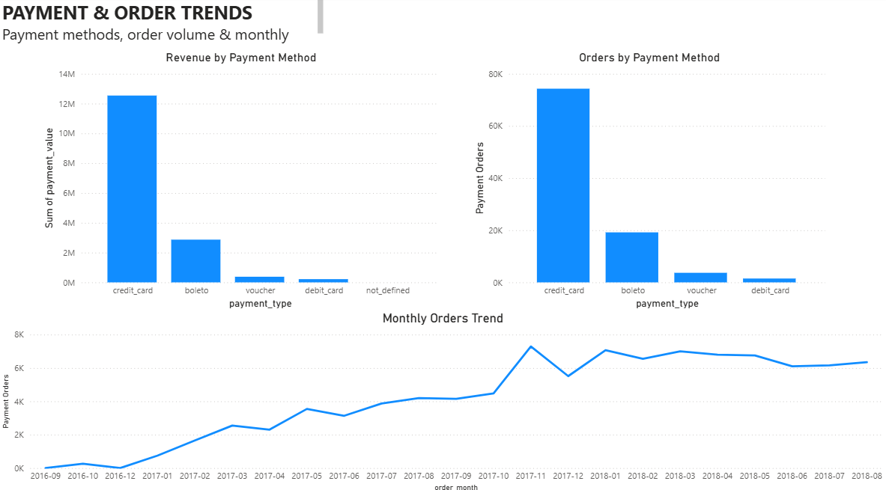

# E-Commerce Sales & Customer Analytics Dashboard

An interactive **Power BI dashboard** built to analyze e-commerce sales, orders, product categories, customer geography, delivery performance, and payment trends.

**Tech:** MySQL · Power BI · DAX · Power Query

## 📊 Dashboard

### 1. Executive Sales Overview


- Total Sales: **13.59M**
- Total Orders: **~99K**
- Average Order Value: **136.68**
- Average Delivery Days: **12.18**
- Monthly sales trend

### 2. Product & Category Analysis


- Sales by product category
- Orders by product category
- Average order value by category

### 3. Delivery & Customer Analysis


- On-time vs late deliveries
- Average delivery time by state
- Orders by state

### 4. Payment & Order Trends


- Revenue by payment method
- Orders by payment method
- Monthly order trend

## 🎯 Business Objectives

- Track overall sales and order performance
- Identify high-performing product categories
- Compare average order value across categories
- Analyze geographic order distribution
- Evaluate delivery performance
- Understand payment-method usage
- Identify monthly sales and order trends

## 🔄 Workflow

```text
E-Commerce Dataset
      ↓
MySQL Data Preparation & Analysis
      ↓
Power BI Data Model
      ↓
DAX Measures & KPIs
      ↓
Interactive Dashboard
      ↓
Business Insights
```

## 📐 Key DAX Measures

```DAX
Total Sales =
SUM('retail_analytics ecommerce'[payment_value])
```

```DAX
Total Orders =
DISTINCTCOUNT('retail_analytics orders'[order_id])
```

```DAX
Average Order Value =
DIVIDE([Total Sales], [Total Orders])
```

```DAX
Average Delivery Days =
AVERAGE('retail_analytics orders'[delivery_days])
```

## 📈 Key Findings

- Total sales reached **13.59M** across approximately **99K orders**.
- **bed_bath_table** is the strongest displayed category by sales and order volume.
- **computers** has the highest average order value among the displayed categories.
- **92.14%** of orders were delivered on time, while **7.86%** were late.
- **São Paulo (SP)** is the dominant market by order volume and sales.
- **Credit card** is the dominant payment method by both order volume and payment value.
- Sales and order activity increased substantially through 2017, with **November 2017** standing out as a major peak.

## 💡 Business Recommendations

1. Maintain strong availability and promotional focus on leading categories.
2. Investigate high-AOV categories for cross-selling and premium-product opportunities.
3. Investigate logistics performance in states with higher delivery times.
4. Prepare inventory and fulfillment capacity for historically strong periods.
5. Continue optimizing the dominant credit-card checkout experience while encouraging alternative payment methods.

## 🧠 Skills Demonstrated

- SQL data analysis
- MySQL
- Power BI
- DAX
- Power Query
- Data modeling
- KPI development
- Data visualization
- Trend analysis
- Geographic analysis
- Business intelligence
- Data storytelling

## 🚀 Future Improvements

- Add date and state slicers
- Add RFM customer segmentation
- Add repeat-customer and retention analysis
- Add profitability analysis when cost data is available
- Add drill-through pages
- Add sales and order forecasting

## 📌 Project Summary

This project demonstrates an end-to-end analytics workflow from **SQL data preparation and analysis to Power BI modeling, DAX calculations, interactive visualization, and business recommendations**, suitable for Data Analyst and Business Intelligence portfolios.
